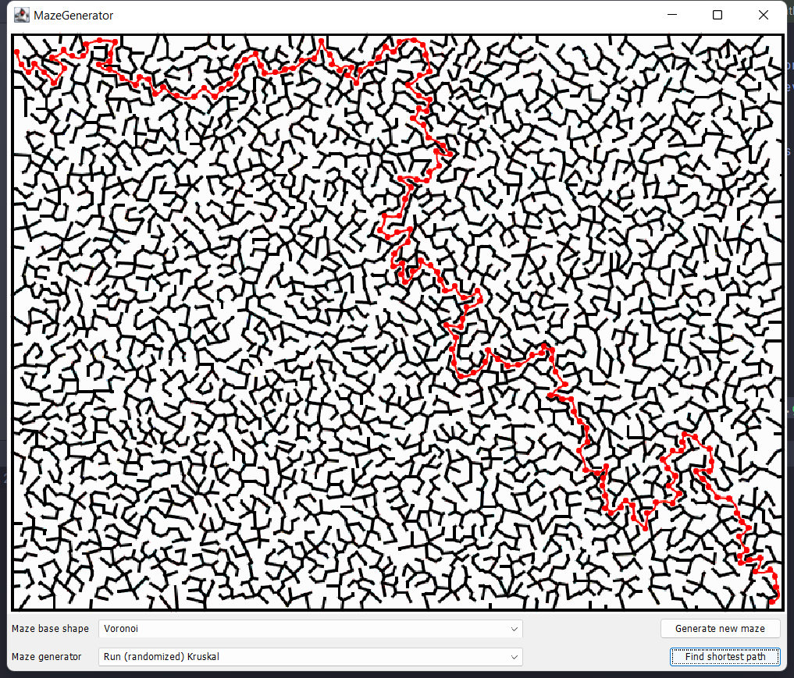
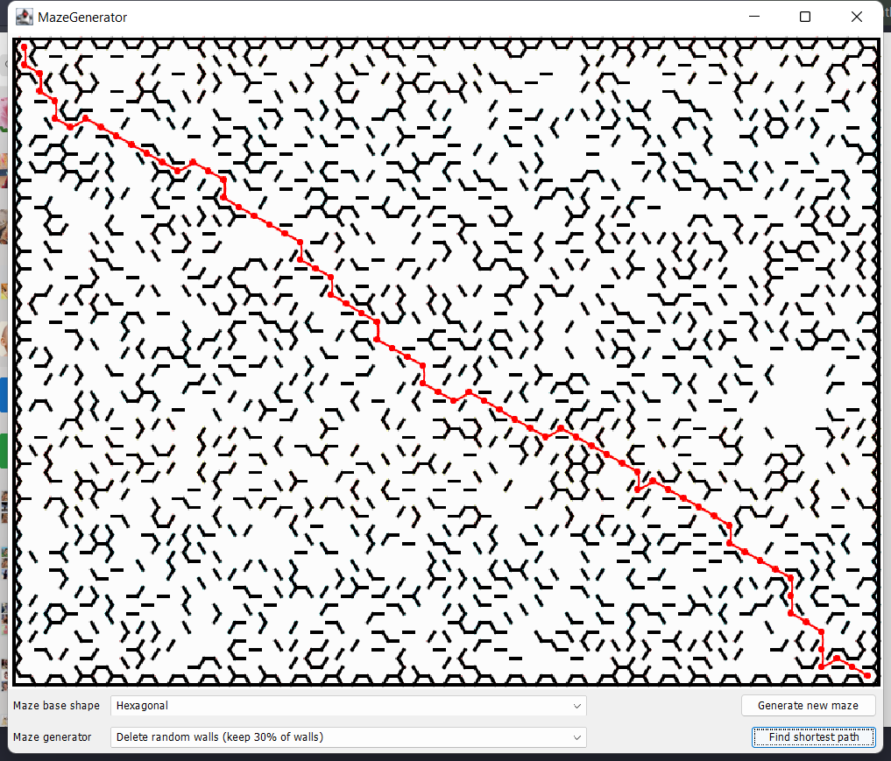
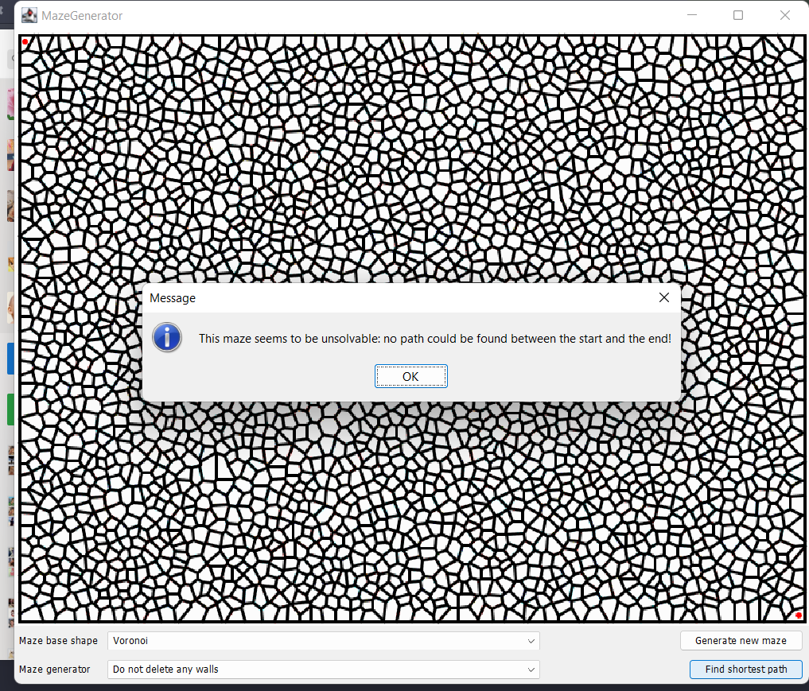
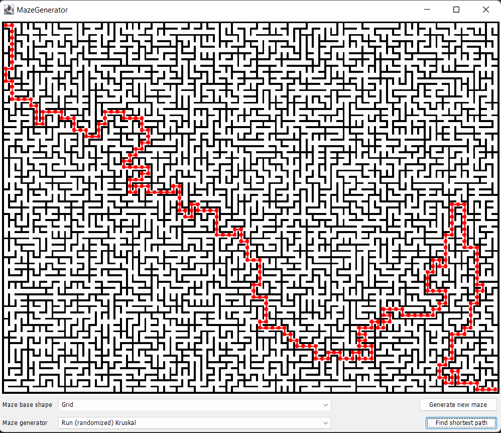

# Mazes-Solver
solve maze with different base shapes

## Overview

I built a Maze Solver to genereate a shorest path using Dijkstra's algorithm in three different Maze base shapes:
* Grid shape
* Voronoi shape
* Hexagonal shape

## Walkthrough

MazeGenerator GUI:

 

 
